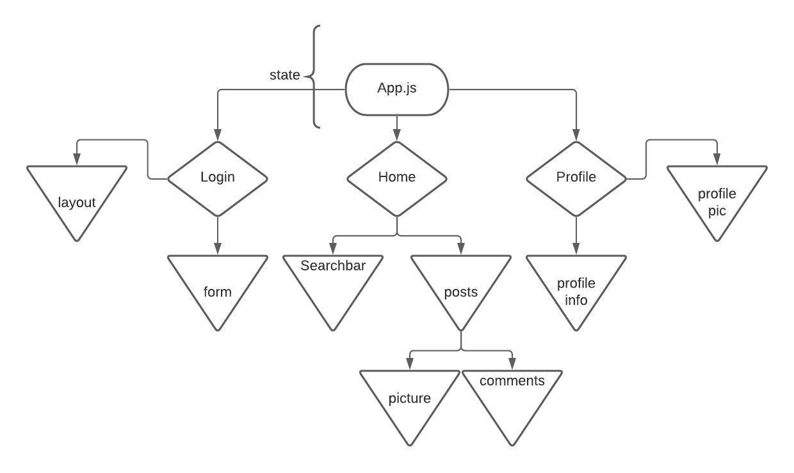

# Pet's-blog

## 11/09/20

### By: Cesar De Casas

[Github](https://github.com/cesardecasas) | [LinkedIn](https://www.linkedin.com/in/cesardecasas/)

***

### Overview

Blog especialized in your pet's life, share those funny, lovely or scary moments your pet has been through. Perfect website for animal lovers

***

### Technologies Used 

* React
* Node.js
* HTML/CSS/Javascript
* Mongoose
* MongoDB

***

### ERD and CHD




***

### How to get started

Install all the independencies needed with either ```npm install ``` or ``` yarn install ``` depending on your package manager.

You can find the deployed link [here]()

***


### User stories

* As a user I should be able to login and have access to my profile
* As a user I should be able to see posts from other people  
* As a user I should be able to create posts and edit my posts
* As a user I should be able to post pictures, videos or texts
* As a user I should be able to like a post 
* As a user I should be able to edit my user name and other public information

***

### Screenshots

Loading...